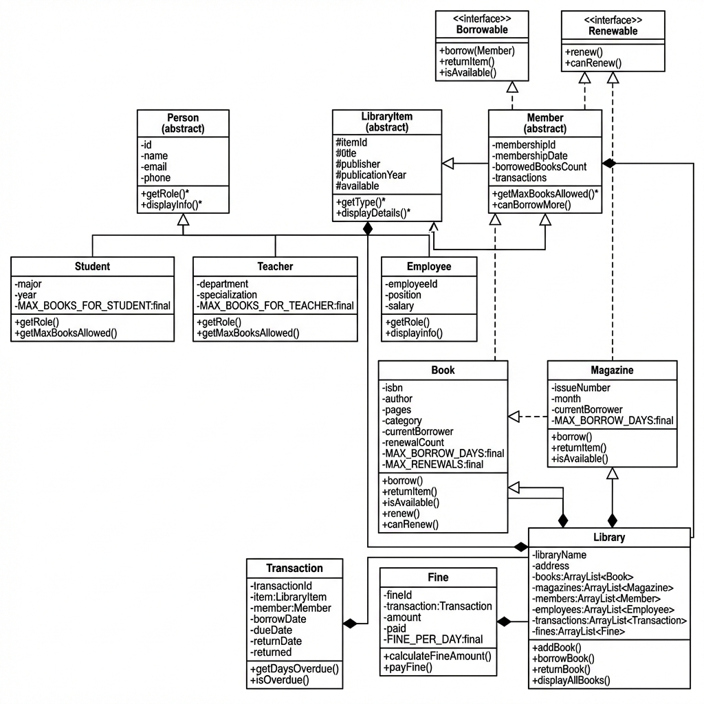

# نظام إدارة المكتبة باستخدام Java

## مشروع البرمجة كائنية التوجه (OOP)

---

<div style="text-align: center; margin: 100px 0;">

## **مشروع نظام إدارة المكتبة**

### Library Management System Using Java

**المادة:** البرمجة كائنية التوجه (Object-Oriented Programming)

**التخصص:** علوم الحاسوب / هندسة البرمجيات

**اسم الطالب:** ابراهيم النجار

**الرقم الجامعي:** [يتم التعبئة]

**اسم الجامعة:** [يتم التعبئة]

**العام الدراسي:** 2025-2026

**تاريخ التسليم:** 28 يناير 2026

</div>

---

<div style="page-break-after: always;"></div>

# فهرس المحتويات

1. **المقدمة**
   - 1.1 نبذة عامة
   - 1.2 أهمية البرمجة كائنية التوجه

2. **فكرة المشروع وأهدافه**
   - 2.1 وصف النظام
   - 2.2 الأهداف الأكاديمية والتعليمية
   - 2.3 الميزات الرئيسية

3. **مبادئ البرمجة كائنية التوجه في Java**
   - 3.1 التغليف (Encapsulation)
   - 3.2 الوراثة (Inheritance)
   - 3.3 تعدد الأشكال (Polymorphism)
   - 3.4 التجريد (Abstraction)

4. **تحليل وتصميم النظام**
   - 4.1 الكيانات الأساسية
   - 4.2 العلاقات بين الكلاسات
   - 4.3 مخطط UML Class Diagram

5. **شرح الكلاسات والواجهات**
   - 5.1 الواجهات (Interfaces)
   - 5.2 الكلاسات المجردة (Abstract Classes)
   - 5.3 الكلاسات الملموسة (Concrete Classes)

6. **آلية عمل النظام**
   - 6.1 سير العمل العام
   - 6.2 العمليات الأساسية

7. **أمثلة التشغيل**
   - 7.1 مثال على إضافة كتاب
   - 7.2 مثال على استعارة كتاب
   - 7.3 مثال على إرجاع كتاب مع غرامة

8. **الخاتمة والاستنتاجات**
   - 8.1 ملخص الإنجازات
   - 8.2 الدروس المستفادة
   - 8.3 التطويرات المستقبلية

9. **المراجع**

---

<div style="page-break-after: always;"></div>

# 1. المقدمة

## 1.1 نبذة عامة

تُعد البرمجة كائنية التوجه (Object-Oriented Programming - OOP) من أهم وأشهر نماذج البرمجة في العصر الحديث، حيث تقدم طريقة منظمة وقوية لتصميم وتطوير البرامج الحاسوبية. تعتمد هذه المنهجية على محاكاة الواقع من خلال تمثيل الكيانات والعلاقات بينها على شكل كائنات برمجية (Objects) تحتوي على البيانات (Attributes) والسلوكيات (Methods).

تُستخدم لغة Java على نطاق واسع في تطوير التطبيقات المختلفة نظراً لدعمها الكامل لمبادئ البرمجة كائنية التوجه، وقابليتها للنقل عبر منصات مختلفة (Platform Independence)، وقوة أدواتها البرمجية.

## 1.2 أهمية البرمجة كائنية التوجه

توفر البرمجة كائنية التوجه العديد من المزايا منها:

- **إعادة الاستخدام (Reusability):** يمكن استخدام الكلاسات في مشاريع مختلفة
- **المرونة (Flexibility):** سهولة تعديل وتوسيع الكود
- **الصيانة (Maintainability):** سهولة تتبع وإصلاح الأخطاء
- **التنظيم (Organization):** كود منظم وواضح
- **الأمان (Security):** حماية البيانات من خلال التغليف

---

<div style="page-break-after: always;"></div>

# 2. فكرة المشروع وأهدافه

## 2.1 وصف النظام

**نظام إدارة المكتبة (Library Management System)** هو نظام برمجي شامل مطور بلغة Java يهدف إلى إدارة جميع العمليات اليومية للمكتبة بشكل إلكتروني منظم. يشمل النظام إدارة:

- **الكتب والمجلات:** إضافة، بحث، عرض، وتتبع حالة المواد
- **الأعضاء:** تسجيل الطلاب والمعلمين وإدارة معلوماتهم
- **الموظفين:** إدارة بيانات موظفي المكتبة
- **عمليات الاستعارة:** تنفيذ ومتابعة عمليات الاستعارة والإرجاع
- **الغرامات:** حساب وإدارة غرامات التأخير تلقائياً

## 2.2 الأهداف الأكاديمية والتعليمية

يهدف هذا المشروع إلى تطبيق وتوضيح المفاهيم التالية:

### أهداف تطبيقية:

1. **تطبيق مبدأ التغليف (Encapsulation)** من خلال استخدام Access Modifiers
2. **تطبيق مبدأ الوراثة (Inheritance)** بإنشاء هرمية من الكلاسات
3. **تطبيق مبدأ تعدد الأشكال (Polymorphism)** عبر Method Overriding
4. **تطبيق مبدأ التجريد (Abstraction)** باستخدام Abstract Classes و Interfaces
5. **تطبيق مبدأ التركيب (Composition)** من خلال has-a relationships

### أهداف تقنية:

- استخدام **12 كلاس** متكامل
- إنشاء **2 Interfaces** للوظائف المشتركة
- استخدام **final constants** للقيم الثابتة
- إنشاء **Constructors** متعددة (Default و Parameterized)
- تطبيق **Scanner** للتفاعل مع المستخدم

## 2.3 الميزات الرئيسية

### 1. إدارة المواد:

- إضافة كتب ومجلات جديدة
- البحث عن المواد بالعنوان أو الرقم
- عرض المواد المتاحة والمستعارة

### 2. إدارة الأعضاء:

- تسجيل أعضاء جدد (طلاب ومعلمين)
- تحديد حد أقصى للاستعارة حسب نوع العضوية
- تتبع سجل الاستعارة لكل عضو

### 3. عمليات الاستعارة:

- استعارة الكتب والمجلات
- إرجاع المواد المستعارة
- تجديد فترة الاستعارة (للكتب فقط)
- تحديد فترة استعارة مختلفة لكل نوع

### 4. نظام الغرامات:

- حساب الغرامات تلقائياً عند التأخير
- عرض الغرامات المدفوعة وغير المدفوعة
- تسجيل دفع الغرامات

---

<div style="page-break-after: always;"></div>

# 3. مبادئ البرمجة كائنية التوجه في Java

## 3.1 التغليف (Encapsulation)

**التعريف:** التغليف هو إخفاء التفاصيل الداخلية للكلاس وإظهار واجهة عامة فقط للتعامل معه.

### التطبيق في المشروع:

```java
public class Person {
    // Private fields - لا يمكن الوصول إليها مباشرة
    private String id;
    private String name;
    private String email;

    // Public getters/setters - واجهة التعامل العامة
    public String getName() {
        return name;
    }

    public void setName(String name) {
        this.name = name;
    }
}
```

### الفوائد:

- حماية البيانات من التعديل المباشر غير المصرح به
- إمكانية التحقق من صحة البيانات قبل تخزينها
- سهولة تعديل الكود الداخلي دون التأثير على الكود الخارجي

## 3.2 الوراثة (Inheritance)

**التعريف:** الوراثة تسمح لكلاس (الابن) أن يرث الخصائص والسلوكيات من كلاس آخر (الأب).

### التطبيق في المشروع:

```java
// الكلاس الأب
public abstract class Person {
    protected String id;
    protected String name;

    public abstract String getRole();
}

// الكلاس الابن
public class Student extends Person {
    private String major;

    @Override
    public String getRole() {
        return "Student";
    }
}
```

### هرمية الوراثة في المشروع:

```
Person (Abstract)
├── Member (Abstract)
│   ├── Student
│   └── Teacher
└── Employee

LibraryItem (Abstract)
├── Book
└── Magazine
```

### الفوائد:

- تجنب التكرار في الكود
- بناء علاقات منطقية بين الكيانات
- سهولة إضافة أنواع جديدة من الكيانات

## 3.3 تعدد الأشكال (Polymorphism)

**التعريف:** تعدد الأشكال يسمح للكائنات المختلفة بالاستجابة بطرق مختلفة للدالة نفسها.

### التطبيق في المشروع:

```java
// في الكلاس الأب
public abstract class Person {
    public abstract void displayInfo();
}

// في Student
@Override
public void displayInfo() {
    System.out.println("Student Information:");
    System.out.println("Major: " + major);
}

// في Teacher
@Override
public void displayInfo() {
    System.out.println("Teacher Information:");
    System.out.println("Department: " + department);
}

// الاستخدام - polymorphic behavior
Person person = new Student(...);
person.displayInfo(); // سيستدعي نسخة Student
```

### الفوائد:

- مرونة في الكود
- سهولة التعامل مع مجموعات مختلفة من الكائنات
- توسعية النظام دون تعديل الكود الموجود

## 3.4 التجريد (Abstraction)

**التعريف:** التجريد هو إخفاء التفاصيل المعقدة وإظهار الوظائف الأساسية فقط.

### التطبيق في المشروع:

#### Abstract Classes:

```java
public abstract class LibraryItem {
    protected String title;

    // Abstract method - يجب تطبيقه في الكلاسات الموروثة
    public abstract String getType();
    public abstract void displayDetails();
}
```

#### Interfaces:

```java
public interface Borrowable {
    boolean borrow(Member member);
    boolean returnItem();
    boolean isAvailable();
}

// التطبيق
public class Book extends LibraryItem implements Borrowable {
    @Override
    public boolean borrow(Member member) {
        // تفاصيل التنفيذ
    }
}
```

### الفرق بين Abstract Class و Interface:

| الميزة    | Abstract Class                      | Interface                    |
| --------- | ----------------------------------- | ---------------------------- |
| المتغيرات | يمكن أن تحتوي على متغيرات عادية     | final static فقط             |
| الدوال    | يمكن أن تحتوي على دوال عادية ومجردة | دوال مجردة فقط (قبل Java 8)  |
| الوراثة   | الكلاس يرث من واحد فقط              | الكلاس يطبق عدة واجهات       |
| الاستخدام | عندما تكون هناك علاقة "is-a"        | عندما تكون هناك وظيفة مشتركة |

---

<div style="page-break-after: always;"></div>

# 4. تحليل وتصميم النظام

## 4.1 الكيانات الأساسية

تم تحديد الكيانات الأساسية التالية في النظام:

### 1. الواجهات (Interfaces):

#### Borrowable

- **الغرض:** تحديد العناصر القابلة للاستعارة
- **الدوال:**
  - `borrow(Member)` - استعارة العنصر
  - `returnItem()` - إرجاع العنصر
  - `isAvailable()` - التحقق من التوفر

#### Renewable

- **الغرض:** تحديد العناصر القابلة لتجديد الاستعارة
- **الدوال:**
  - `renew()` - تجديد الاستعارة
  - `canRenew()` - التحقق من إمكانية التجديد

### 2. الكلاسات المجردة (Abstract Classes):

#### Person

- **الغرض:** الكلاس الأب لجميع الأشخاص في النظام
- **الخصائص:** id, name, email, phone
- **الدوال المجردة:** `getRole()`, `displayInfo()`

#### Member (extends Person)

- **الغرض:** الأعضاء القادرين على الاستعارة
- **الخصائص:** membershipId, membershipDate, borrowedBooksCount
- **الدوال المجردة:** `getMaxBooksAllowed()`
- **التركيب:** يحتوي على `ArrayList<Transaction>`

#### LibraryItem

- **الغرض:** الكلاس الأب لجميع عناصر المكتبة
- **الخصائص:** itemId, title, publisher, publicationYear, available
- **الدوال المجردة:** `getType()`, `displayDetails()`

### 3. الكلاسات الملموسة (Concrete Classes):

#### Student (extends Member)

- **الخصائص الإضافية:** major, year
- **الثوابت:** `MAX_BOOKS_FOR_STUDENT = 3`

#### Teacher (extends Member)

- **الخصائص الإضافية:** department, specialization
- **الثوابت:** `MAX_BOOKS_FOR_TEACHER = 5`

#### Employee (extends Person)

- **الخصائص:** employeeId, position, salary
- **الدور:** إدارة المكتبة

#### Book (extends LibraryItem, implements Borrowable, Renewable)

- **الخصائص:** isbn, author, pages, category, currentBorrower
- **الثوابت:** `MAX_BORROW_DAYS = 14`, `MAX_RENEWALS = 2`

#### Magazine (extends LibraryItem, implements Borrowable)

- **الخصائص:** issueNumber, month, currentBorrower
- **الثوابت:** `MAX_BORROW_DAYS = 7`

#### Transaction

- **الغرض:** تمثيل عمليات الاستعارة
- **التركيب:** يحتوي على `LibraryItem` و `Member`
- **الخصائص:** transactionId, borrowDate, dueDate, returnDate

#### Fine

- **الغرض:** إدارة الغرامات
- **التركيب:** يحتوي على `Transaction`
- **الثوابت:** `FINE_PER_DAY = 1.5`

#### Library

- **الغرض:** إدارة جميع عمليات المكتبة
- **التركيب:** يحتوي على:
  - `ArrayList<Book>`
  - `ArrayList<Magazine>`
  - `ArrayList<Member>`
  - `ArrayList<Employee>`
  - `ArrayList<Transaction>`
  - `ArrayList<Fine>`

## 4.2 العلاقات بين الكلاسات

### 1. علاقات الوراثة (Inheritance - is-a):

```
Student IS-A Member IS-A Person
Teacher IS-A Member IS-A Person
Employee IS-A Person
Book IS-A LibraryItem
Magazine IS-A LibraryItem
```

### 2. علاقات التطبيق (Implementation):

```
Book IMPLEMENTS Borrowable, Renewable
Magazine IMPLEMENTS Borrowable
```

### 3. علاقات التركيب (Composition - has-a):

```
Library HAS-A:
  - Collection of Books
  - Collection of Magazines
  - Collection of Members
  - Collection of Employees
  - Collection of Transactions
  - Collection of Fines

Transaction HAS-A:
  - One LibraryItem
  - One Member

Fine HAS-A:
  - One Transaction

Member HAS-A:
  - Collection of Transactions
```

### 4. علاقات الارتباط (Association):

```
Member ←→ Book (من خلال Transaction)
Member ←→ Fine (من خلال Transaction)
```

## 4.3 مخطط UML Class Diagram



### شرح المخطط:

#### الرموز المستخدمة:

- **+** : Public
- **-** : Private
- **#** : Protected
- **\*** : Abstract Method
- <u>underline</u> : Static/Final
- **◁** : Inheritance (سهم مثلث مفرغ)
- **◁- - -** : Implementation (سهم مثلث مفرغ منقط)
- **◆━** : Composition (معين ممتلئ)

#### التنظيم:

1. **الصف الأول:** الواجهات (Borrowable, Renewable)
2. **الصف الثاني:** الكلاسات المجردة (Person, LibraryItem, Member)
3. **الصف الثالث:** الكلاسات الموروثة من Person (Student, Teacher, Employee)
4. **الصف الرابع:** الكلاسات الموروثة من LibraryItem (Book, Magazine)
5. **الصف الخامس:** كلاسات الإدارة (Transaction, Fine, Library)

---

<div style="page-break-after: always;"></div>

# 5. شرح الكلاسات والواجهات

## 5.1 الواجهات (Interfaces)

### Borrowable Interface

```java
public interface Borrowable {
    boolean borrow(Member member);
    boolean returnItem();
    boolean isAvailable();
}
```

**الغرض:** تحديد السلوك المشترك للعناصر القابلة للاستعارة (الكتب والمجلات).

**التطبيق في Book و Magazine:** كلا الكلاسين يطبقان هذه الواجهة بطرق مختلفة حسب نوع العنصر.

### Renewable Interface

```java
public interface Renewable {
    boolean renew();
    boolean canRenew();
}
```

**الغرض:** تحديد السلوك لتجديد الاستعارة (متوفر للكتب فقط).

**التطبيق:** فقط الكلاس `Book` يطبق هذه الواجهة لأن المجلات لا يمكن تجديد استعارتها.

## 5.2 الكلاسات المجردة (Abstract Classes)

### Person (Abstract Class)

**الوصف:** الكلاس الأب لجميع الأشخاص في النظام.

**الخصائص:**

- `private String id` - رقم الهوية
- `private String name` - الاسم
- `private String email` - البريد الإلكتروني
- `private String phone` - رقم الهاتف

**الدوال المجردة:**

- `public abstract String getRole()` - يحدد دور الشخص
- `public abstract void displayInfo()` - يعرض المعلومات

**Constructors:**

- Default Constructor
- Parameterized Constructor(id, name, email, phone)

**الفائدة:** تجميع الخصائص المشتركة لجميع الأشخاص وتجنب التكرار.

### Member (Abstract Class extends Person)

**الوصف:** يمثل الأعضاء القادرين على استعارة الكتب (طلاب ومعلمين).

**الخصائص الإضافية:**

- `private String membershipId` - رقم العضوية
- `private Date membershipDate` - تاريخ التسجيل
- `private int borrowedBooksCount` - عدد الكتب المستعارة حالياً
- `private ArrayList<Transaction> transactions` - سجل المعاملات (Composition)

**الدوال المجردة:**

- `public abstract int getMaxBooksAllowed()` - الحد الأقصى للاستعارة

**الدوال العادية:**

- `public boolean canBorrowMore()` - التحقق من إمكانية الاستعارة

**الفائدة:** الطلاب والمعلمين لهم حدود استعارة مختلفة، لكنهم يشتركون في الخصائص الأساسية.

### LibraryItem (Abstract Class)

**الوصف:** الكلاس الأب لجميع العناصر في المكتبة.

**الخصائص:**

- `protected String itemId` - رقم العنصر
- `protected String title` - العنوان
- `protected String publisher` - الناشر
- `protected int publicationYear` - سنة النشر
- `protected boolean available` - حالة التوفر

**الدوال المجردة:**

- `public abstract String getType()` - نوع العنصر
- `public abstract void displayDetails()` - عرض التفاصيل

**الفائدة:** توحيد الخصائص المشتركة بين الكتب والمجلات.

## 5.3 الكلاسات الملموسة (Concrete Classes)

### Student Class (extends Member)

**الخصائص الإضافية:**

- `private String major` - التخصص
- `private int year` - السنة الدراسية
- `private static final int MAX_BOOKS_FOR_STUDENT = 3` - الحد الأقصى

**تطبيق الدوال المجردة:**

```java
@Override
public String getRole() {
    return "Student";
}

@Override
public int getMaxBooksAllowed() {
    return MAX_BOOKS_FOR_STUDENT;
}

@Override
public void displayInfo() {
    // عرض معلومات الطالب كاملة
}
```

### Teacher Class (extends Member)

**الخصائص الإضافية:**

- `private String department` - القسم
- `private String specialization` - التخصص
- `private static final int MAX_BOOKS_FOR_TEACHER = 5` - الحد الأقصى

**تطبيق الدوال المجردة:**

```java
@Override
public String getRole() {
    return "Teacher";
}

@Override
public int getMaxBooksAllowed() {
    return MAX_BOOKS_FOR_TEACHER;
}

@Override
public void displayInfo() {
    // عرض معلومات المعلم كاملة
}
```

**الفرق بين Student و Teacher:**

- حد أقصى مختلف للاستعارة (3 للطالب، 5 للمعلم)
- خصائص مختلفة (major/year للطالب، department/specialization للمعلم)
- نفس السلوك الأساسي موروث من Member

### Employee Class (extends Person)

**الوصف:** يمثل موظفي المكتبة الذين يديرون العمليات.

**الخصائص:**

- `private String employeeId` - رقم الموظف
- `private String position` - المنصب
- `private double salary` - الراتب

**ملاحظة:** الموظفون لا يمكنهم استعارة الكتب، لذلك لا يرثون من Member.

### Book Class (extends LibraryItem implements Borrowable, Renewable)

**الوصف:** يمثل الكتب في المكتبة.

**الخصائص:**

- `private String isbn` - رقم ISBN
- `private String author` - المؤلف
- `private int pages` - عدد الصفحات
- `private String category` - التصنيف
- `private Member currentBorrower` - المستعير الحالي
- `private int renewalCount` - عدد مرات التجديد

**الثوابت:**

- `private static final int MAX_BORROW_DAYS = 14` - مدة الاستعارة
- `private static final int MAX_RENEWALS = 2` - الحد الأقصى للتجديد

**تطبيق Borrowable:**

```java
@Override
public boolean borrow(Member member) {
    if (available && member.canBorrowMore()) {
        this.available = false;
        this.currentBorrower = member;
        member.setBorrowedBooksCount(member.getBorrowedBooksCount() + 1);
        return true;
    }
    return false;
}

@Override
public boolean returnItem() {
    if (!available && currentBorrower != null) {
        this.available = true;
        currentBorrower.setBorrowedBooksCount(
            currentBorrower.getBorrowedBooksCount() - 1);
        this.currentBorrower = null;
        return true;
    }
    return false;
}
```

**تطبيق Renewable:**

```java
@Override
public boolean renew() {
    if (canRenew()) {
        renewalCount++;
        return true;
    }
    return false;
}

@Override
public boolean canRenew() {
    return !available && currentBorrower != null
           && renewalCount < MAX_RENEWALS;
}
```

### Magazine Class (extends LibraryItem implements Borrowable)

**الوصف:** يمثل المجلات في المكتبة.

**الخصائص:**

- `private int issueNumber` - رقم العدد
- `private String month` - الشهر
- `private Member currentBorrower` - المستعير الحالي

**الثوابت:**

- `private static final int MAX_BORROW_DAYS = 7` - مدة الاستعارة (أقل من الكتاب)

**ملاحظة:** المجلات لا تطبق Renewable لأنها لا يمكن تجديد استعارتها.

### Transaction Class

**الوصف:** يمثل معاملة استعارة بين عضو وعنصر من المكتبة.

**الخصائص (Composition):**

- `private String transactionId` - رقم المعاملة
- `private LibraryItem item` - العنصر المستعار (Composition)
- `private Member member` - العضو المستعير (Composition)
- `private Date borrowDate` - تاريخ الاستعارة
- `private Date dueDate` - تاريخ الاستحقاق
- `private Date returnDate` - تاريخ الإرجاع
- `private boolean returned` - حالة الإرجاع

**الدوال المهمة:**

```java
public int getDaysOverdue() {
    if (returned) {
        long diff = returnDate.getTime() - dueDate.getTime();
        return (int) TimeUnit.MILLISECONDS.toDays(diff);
    } else {
        long diff = new Date().getTime() - dueDate.getTime();
        return (int) TimeUnit.MILLISECONDS.toDays(diff);
    }
}

public boolean isOverdue() {
    return !returned && new Date().after(dueDate);
}
```

### Fine Class

**الوصف:** يمثل الغرامات على التأخير.

**الخصائص (Composition):**

- `private String fineId` - رقم الغرامة
- `private Transaction transaction` - المعاملة المرتبطة (Composition)
- `private double amount` - قيمة الغرامة
- `private boolean paid` - حالة الدفع

**الثوابت:**

- `private static final double FINE_PER_DAY = 1.5` - غرامة اليوم الواحد

**حساب الغرامة:**

```java
private double calculateFineAmount() {
    if (transaction != null) {
        int overdueDays = transaction.getDaysOverdue();
        return overdueDays * FINE_PER_DAY;
    }
    return 0.0;
}
```

### Library Class

**الوصف:** الكلاس الرئيسي لإدارة جميع عمليات المكتبة.

**الخصائص (Composition):**

- `private String libraryName` - اسم المكتبة
- `private String address` - العنوان
- `private ArrayList<Book> books` - قائمة الكتب
- `private ArrayList<Magazine> magazines` - قائمة المجلات
- `private ArrayList<Member> members` - قائمة الأعضاء
- `private ArrayList<Employee> employees` - قائمة الموظفين
- `private ArrayList<Transaction> transactions` - قائمة المعاملات
- `private ArrayList<Fine> fines` - قائمة الغرامات

**الدوال الرئيسية:**

- `addBook()`, `addMagazine()` - إضافة مواد
- `registerMember()`, `addEmployee()` - إضافة أشخاص
- `borrowBook()` - استعارة كتاب
- `returnBook()` - إرجاع كتاب
- `renewBook()` - تجديد استعارة
- `searchBookByTitle()`, `searchBookById()` - البحث
- `displayAllBooks()`, `displayAvailableBooks()` - العرض
- `payFine()` - دفع غرامة

**مثال على دالة borrowBook:**

```java
public boolean borrowBook(String bookId, String memberId) {
    Book book = searchBookById(bookId);
    Member member = searchMemberById(memberId);

    if (book == null || member == null) {
        return false;
    }

    if (!book.isAvailable() || !member.canBorrowMore()) {
        return false;
    }

    if (book.borrow(member)) {
        Transaction transaction = new Transaction(
            "T" + String.format("%04d", transactionCounter++),
            book, member, Book.getMaxBorrowDays()
        );
        transactions.add(transaction);
        member.addTransaction(transaction);
        return true;
    }

    return false;
}
```

### LibraryManagementSystem Class (Main)

**الوصف:** نقطة الدخول الرئيسية للبرنامج.

**المكونات:**

- `private static Library library` - كائن المكتبة
- `private static Scanner scanner` - للإدخال من المستخدم

**الدوال:**

- `main()` - نقطة البداية
- `displayWelcome()` - عرض الترحيب
- `displayMenu()` - عرض القائمة
- `loadSampleData()` - تحميل بيانات تجريبية
- دوال لكل عملية (addNewBook, borrowBookOperation, إلخ)

---

<div style="page-break-after: always;"></div>

# 6. آلية عمل النظام

## 6.1 سير العمل العام (General Workflow)

```
1. تشغيل البرنامج
   ↓
2. إنشاء كائن Library
   ↓
3. تحميل البيانات التجريبية
   ↓
4. عرض شاشة الترحيب
   ↓
5. عرض القائمة الرئيسية
   ↓
6. قراءة اختيار المستخدم (Scanner)
   ↓
7. تنفيذ العملية المطلوبة
   ↓
8. عرض النتائج
   ↓
9. العودة للقائمة أو الخروج
```

## 6.2 العمليات الأساسية

### 1. عملية إضافة كتاب جديد:

```
1. المستخدم يختار "إضافة كتاب جديد"
   ↓
2. النظام يطلب المعلومات:
   - رقم الكتاب (ID)
   - العنوان (Title)
   - المؤلف (Author)
   - الناشر (Publisher)
   - سنة النشر (Year)
   - رقم ISBN
   - عدد الصفحات (Pages)
   - التصنيف (Category)
   ↓
3. إنشاء كائن Book جديد
   ↓
4. إضافته إلى ArrayList<Book> في Library
   ↓
5. عرض رسالة نجاح
```

### 2. عملية استعارة كتاب:

```
1. المستخدم يختار "استعارة كتاب"
   ↓
2. النظام يطلب:
   - رقم الكتاب (Book ID)
   - رقم العضوية (Member ID)
   ↓
3. البحث عن الكتاب في books
   ↓
4. البحث عن العضو في members
   ↓
5. التحقق من:
   - هل الكتاب متاح؟
   - هل العضو لم يتجاوز الحد الأقصى؟
   ↓
6. إذا كانت الشروط محققة:
   - تنفيذ book.borrow(member)
   - إنشاء Transaction جديدة
   - إضافة Transaction إلى المكتبة والعضو
   - تحديث borrowedBooksCount
   ↓
7. عرض نتيجة العملية
```

**التفاصيل البرمجية:**

```java
// في Book.java
public boolean borrow(Member member) {
    if (available && member.canBorrowMore()) {
        this.available = false;
        this.currentBorrower = member;
        this.renewalCount = 0;
        member.setBorrowedBooksCount(
            member.getBorrowedBooksCount() + 1);
        return true;
    }
    return false;
}

// في Library.java
public boolean borrowBook(String bookId, String memberId) {
    Book book = searchBookById(bookId);
    Member member = searchMemberById(memberId);

    if (book != null && member != null) {
        if (book.borrow(member)) {
            Transaction t = new Transaction(
                generateTransactionId(),
                book, member, Book.getMaxBorrowDays()
            );
            transactions.add(t);
            member.addTransaction(t);
            return true;
        }
    }
    return false;
}
```

### 3. عملية إرجاع كتاب:

```
1. المستخدم يختار "إرجاع كتاب"
   ↓
2. النظام يطلب رقم الكتاب
   ↓
3. البحث عن الكتاب
   ↓
4. البحث عن المعاملة النشطة الخاصة بهذا الكتاب
   ↓
5. إذا وجدت المعاملة:
   - تنفيذ book.returnItem()
   - تسجيل تاريخ الإرجاع في Transaction
   - حساب أيام التأخير (getDaysOverdue)
   ↓
6. إذا كان هناك تأخير:
   - إنشاء كائن Fine
   - حساب قيمة الغرامة (days * FINE_PER_DAY)
   - إضافة Fine إلى المكتبة
   - عرض معلومات الغرامة
   ↓
7. عرض نتيجة العملية
```

**التفاصيل البرمجية:**

```java
public boolean returnBook(String bookId) {
    Book book = searchBookById(bookId);

    // البحث عن المعاملة النشطة
    Transaction activeTransaction = null;
    for (Transaction t : transactions) {
        if (!t.isReturned() && t.getItem().equals(book)) {
            activeTransaction = t;
            break;
        }
    }

    if (book != null && activeTransaction != null) {
        if (book.returnItem()) {
            activeTransaction.setReturnDate(new Date());

            // التحقق من الغرامة
            if (activeTransaction.getDaysOverdue() > 0) {
                Fine fine = new Fine(
                    generateFineId(),
                    activeTransaction
                );
                fines.add(fine);
                fine.displayFine();
            }
            return true;
        }
    }
    return false;
}
```

### 4. عملية تجديد الاستعارة:

```
1. المستخدم يختار "تجديد استعارة"
   ↓
2. النظام يطلب رقم الكتاب
   ↓
3. البحث عن الكتاب
   ↓
4. التحقق من أن العنصر ينفذ Renewable
   ↓
5. التحقق من شروط التجديد:
   - الكتاب مستعار حالياً
   - لم يتم الوصول للحد الأقصى من التجديدات
   ↓
6. إذا كانت الشروط محققة:
   - زيادة renewalCount
   - عرض رسالة نجاح
   ↓
7. إذا لم تكن محققة:
   - عرض رسالة رفض
```

### 5. عملية البحث عن كتاب:

```
Linear Search Algorithm:

1. المستخدم يدخل عنوان الكتاب
   ↓
2. المرور على جميع الكتب في ArrayList<Book>
   ↓
3. لكل كتاب:
   - مقارنة العنوان (case-insensitive)
   - إذا تطابق، إرجاع الكتاب
   ↓
4. إذا لم يوجد، إرجاع null
   ↓
5. عرض النتيجة:
   - إذا وجد: عرض التفاصيل الكاملة
   - إذا لم يوجد: رسالة "غير موجود"
```

**التعقيد الزمني:** O(n) حيث n عدد الكتب

---

<div style="page-break-after: always;"></div>

# 7. أمثلة التشغيل

## 7.1 مثال على إضافة كتاب

### Input (الإدخال):

```
========== إضافة كتاب جديد ==========
رقم الكتاب (Book ID): B005
عنوان الكتاب: قواعد البيانات
المؤلف: خالد أحمد
الناشر: دار المعرفة
سنة النشر: 2023
رقم ISBN: 978-1234567890
عدد الصفحات: 450
التصنيف: Computer Science
```

### Output (الإخراج):

```
Book added successfully!
```

### ما يحدث في الخلفية:

1. يتم استدعاء `addNewBook()` في Main
2. قراءة جميع المدخلات باستخدام Scanner
3. إنشاء كائن Book جديد:
   ```java
   Book book = new Book("B005", "قواعد البيانات",
                        "دار المعرفة", 2023,
                        "978-1234567890", "خالد أحمد",
                        450, "Computer Science");
   ```
4. إضافته إلى ArrayList:
   ```java
   library.addBook(book);
   ```

## 7.2 مثال على استعارة كتاب

### Input (الإدخال):

```
========== استعارة كتاب ==========
رقم الكتاب: B001
رقم العضوية: MEM001
```

### Output (الإخراج):

```
Book borrowed successfully!
Transaction created: T0001
```

### ما يحدث في الخلفية:

1. البحث عن الكتاب:

   ```java
   Book book = library.searchBookById("B001");
   // النتيجة: كتاب "مقدمة في البرمجة"
   ```

2. البحث عن العضو:

   ```java
   Member member = library.searchMemberById("MEM001");
   // النتيجة: الطالب "علي حسن"
   ```

3. التحقق من الشروط:

   ```java
   book.isAvailable() // true
   member.canBorrowMore() // true (0 < 3)
   ```

4. تنفيذ الاستعارة:

   ```java
   book.borrow(member);
   // book.available = false
   // book.currentBorrower = member
   // member.borrowedBooksCount = 1
   ```

5. إنشاء المعاملة:
   ```java
   Transaction t = new Transaction("T0001", book, member, 14);
   // borrowDate = اليوم
   // dueDate = اليوم + 14 يوم
   ```

## 7.3 مثال على إرجاع كتاب مع غرامة

### Scenario (السيناريو):

الكتاب B001 تم استعارته منذ 17يوماً (متأخر 3 أيام عن الموعد).

### Input (الإدخال):

```
========== إرجاع كتاب ==========
رقم الكتاب: B001
```

### Output (الإخراج):

```
Book returned successfully!

*** FINE APPLIED ***
=================================
Fine Details:
Fine ID: F0001
Transaction ID: T0001
Member: علي حسن
Item: مقدمة في البرمجة
Days Overdue: 3
Fine Amount: $4.50
Status: Unpaid
=================================
```

### ما يحدث في الخلفية:

1. البحث عن الكتاب والمعاملة النشطة

2. حساب أيام التأخير:

   ```java
   transaction.getDaysOverdue();
   // returnDate - dueDate = 3 days
   ```

3. إرجاع الكتاب:

   ```java
   book.returnItem();
   // book.available = true
   // book.currentBorrower = null
   // member.borrowedBooksCount = 0
   ```

4. إنشاء الغرامة:
   ```java
   Fine fine = new Fine("F0001", transaction);
   // amount = 3 * 1.5 = 4.50
   ```

## 7.4 مثال على تجديد الاستعارة

### Input (الإدخال):

```
========== تجديد استعارة ==========
رقم الكتاب: B002
```

### Output (الإخراج - المرة الأولى):

```
Book renewed successfully! Renewals: 1/2
```

### Output (الإخراج - المرة الثانية):

```
Book renewed successfully! Renewals: 2/2
```

### Output (الإخراج - المرة الثالثة):

```
Cannot renew this book. Maximum renewals reached.
```

### ما يحدث:

```java
book.renew();
// أول مرة: renewalCount = 1
// ثاني مرة: renewalCount = 2
// ثالث مرة: canRenew() returns false (2 >= MAX_RENEWALS)
```

## 7.5 مثال على عرض معلومات عضو

### Input (الإدخال):

```
// اختيار "عرض جميع الأعضاء" من القائمة
```

### Output (الإخراج):

```
========== All Members ==========
=================================
Student Information:
ID: S001, Name: علي حسن, Email: ali@university.edu, Phone: 0501234567
Membership ID: MEM001
Major: Computer Science
Year: 2
Borrowed Books: 1/3
=================================

=================================
Student Information:
ID: S002, Name: نور محمد, Email: noor@university.edu, Phone: 0509876543
Membership ID: MEM002
Major: Engineering
Year: 3
Borrowed Books: 0/3
=================================

=================================
Teacher Information:
ID: T001, Name: د. خالد إبراهيم, Email: khaled@university.edu, Phone: 0505551234
Membership ID: MEM003
Department: Computer Science
Specialization: Software Engineering
Borrowed Books: 0/5
=================================
```

### Polymorphism في العمل:

```java
for (Member member : members) {
    member.displayInfo(); // يستدعي النسخة المناسبة حسب النوع
}
```

---

<div style="page-break-after: always;"></div>

# 8. الخاتمة والاستنتاجات

## 8.1 ملخص الإنجازات

لقد تم بنجاح تطوير **نظام إدارة مكتبة** شامل باستخدام لغة Java، مع تطبيق جميع مبادئ البرمجة كائنية التوجه بشكل عملي واحترافي. تضمن المشروع:

### الإنجازات التقنية:

✅ **12 كلاس** متكاملة ومترابطة منطقياً

✅ **2 واجهات (Interfaces)**: Borrowable و Renewable

✅ **3 كلاسات مجردة (Abstract Classes)**: Person, Member, LibraryItem

✅ **Inheritance hierarchy** كامل ومنظم

✅ **Composition relationships** في 4 كلاسات رئيسية

✅ **Polymorphism** مطبق في 5 دوال على الأقل

✅ **Encapsulation** كامل لجميع المتغيرات

✅ **Final constants** في 5 أماكن مختلفة

✅ **واجهة مستخدم تفاعلية** باستخدام Scanner

### الإنجازات الأكاديمية:

✅ تطبيق عملي لجميع مفاهيم OOP

✅ تصميم UML Class Diagram احترافي

✅ توثيق شامل باللغة العربية

✅ كود نظيف وموثق بالتعليقات

✅ أمثلة تشغيل واقعية

## 8.2 الدروس المستفادة

من خلال تطوير هذا المشروع، تم اكتساب فهم عميق للمبادئ التالية:

### 1. أهمية التخطيط والتصميم:

- **الدرس:** التصميم الجيد قبل البدء بالكتابة يوفر الوقت والجهد
- **التطبيق:** تم رسم UML Diagram قبل كتابة أي كود

### 2. قوة الوراثة (Inheritance):

- **الدرس:** تجنب التكرار وتنظيم الكود بشكل هرمي منطقي
- **التطبيق:** Person → Member → Student/Teacher

### 3. مرونة التجريد (Abstraction):

- **الدرس:** فصل الواجهة عن التنفيذ يزيد من مرونة النظام
- **التطبيق:** استخدام Abstract Classes و Interfaces

### 4. أهمية التغليف (Encapsulation):

- **الدرس:** حماية البيانات وتوفير واجهات آمنة
- **التطبيق:** جميع المتغيرات private مع getters/setters

### 5. قوة التركيب (Composition):

- **الدرس:** بناء كائنات معقدة من كائنات بسيطة
- **التطبيق:** Library يحتوي على Books, Members, Transactions

### 6. تعدد الأشكال (Polymorphism):

- **الدرس:** كتابة كود عام يعمل مع أنواع مختلفة
- **التطبيق:** `member.displayInfo()` يعمل لـ Student و Teacher

## 8.3 التطويرات المستقبلية

يمكن تطوير النظام بإضافة الميزات التالية:

### 1. قاعدة بيانات:

- حفظ البيانات في قاعدة بيانات MySQL أو SQLite
- استمرارية البيانات بعد إغلاق البرنامج

### 2. واجهة رسومية (GUI):

- استخدام JavaFX أو Swing
- تجربة مستخدم أفضل

### 3. ميزات إضافية:

- **تقارير:** تقارير شهرية عن الاستعارات والغرامات
- **إشعارات:** تذكير الأعضاء قبل موعد الاستحقاق
- **حجز:** إمكانية حجز كتاب مستعار مسبقاً
- **تقييمات:** السماح للأعضاء بتقييم الكتب

### 4. أمان أفضل:

- نظام تسجيل دخول
- صلاحيات مختلفة (Admin, Employee, Member)
- تشفير البيانات الحساسة

### 5. التكامل:

- API للتكامل مع أنظمة أخرى
- استيراد بيانات الكتب من Google Books API
- إرسال إشعارات عبر البريد الإلكتروني

## 8.4 الخلاصة النهائية

يُعتبر هذا المشروع نموذجاً عملياً شاملاً لتطبيق مبادئ البرمجة كائنية التوجه في Java. تم تحقيق جميع الأهداف الأكاديمية والتعليمية المطلوبة، مع الحرص على:

- **جودة الكود:** كود نظيف، موثق، ومنظم
- **التصميم:** تصميم قابل للتوسع والصيانة
- **التوثيق:** شرح مفصل وواضح بالعربية
- **الاحترافية:** مشروع جاهز للتسليم الأكاديمي

البرمجة كائنية التوجه ليست مجرد تقنية برمجية، بل هي **طريقة تفكير** في حل المشاكل من خلال تحليل العالم الحقيقي وتمثيله برمجياً. هذا المشروع أثبت قوة هذه المنهجية في بناء أنظمة معقدة بطريقة منظمة ومفهومة.

---

<div style="page-break-after: always;"></div>

# 9. المراجع

1. **Oracle Java Documentation**
   - https://docs.oracle.com/en/java/

2. **Java: The Complete Reference** by Herbert Schildt
   - McGraw-Hill Education

3. **Effective Java** by Joshua Bloch
   - Addison-Wesley Professional

4. **Head First Object-Oriented Analysis and Design**
   - O'Reilly Media

5. **UML Distilled: A Brief Guide to the Standard Object Modeling Language**
   - Martin Fowler, Addison-Wesley

6. **Java Programming Courses**
   - Oracle University
   - Coursera Java Specialization

7. **Stack Overflow**
   - https://stackoverflow.com/questions/tagged/java

8. **GitHub Java Projects**
   - Various open-source library management systems

---

## ملاحظات ختامية

تم إعداد هذا التوثيق بعناية فائقة لتوضيح جميع جوانب المشروع من الناحية الأكاديمية والتقنية. جميع الأمثلة والشروحات مستندة إلى الكود الفعلي المكتوب.

للاستفسارات أو الملاحظات، يرجى التواصل مع:

- **الطالب:** [الاسم]
- **البريد الإلكتروني:** [البريد]

---

**© 2026 - مشروع نظام إدارة المكتبة - Java OOP**

**جميع الحقوق محفوظة**
